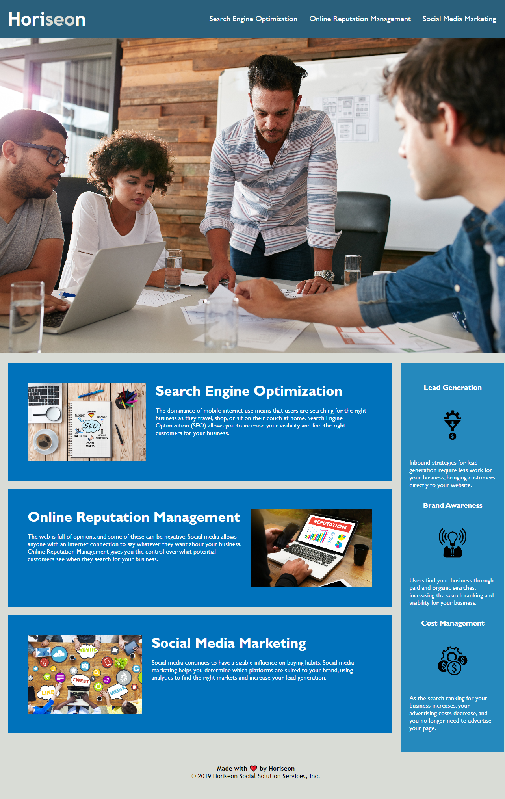

# Horiseon Code Refactor

## Description

The purpose of this task is to improve the codebase for the marketing agency Horiseon so that it follows accessibility standards. This will make it so that their site is optimized for search engines. Improvements to their codebase have been made, including adding semantic HTML elements, structuring the HTML elements, adding accessible alt attributes, putting heading attributes in sequential order, and adding a descriptive title element, to ensure their codebase follows accessability standards.

## Installation

N/A

## Usage

This website's code has been refactored for accessability. Reference the code to view semantic HTML elements, logical HTML structures, accessible alt attributes, and sequentially ordered heading attributes.

Link to deployed website: https://mtstall.github.io/horiseon-code-refactor/

## Credits

N/A
